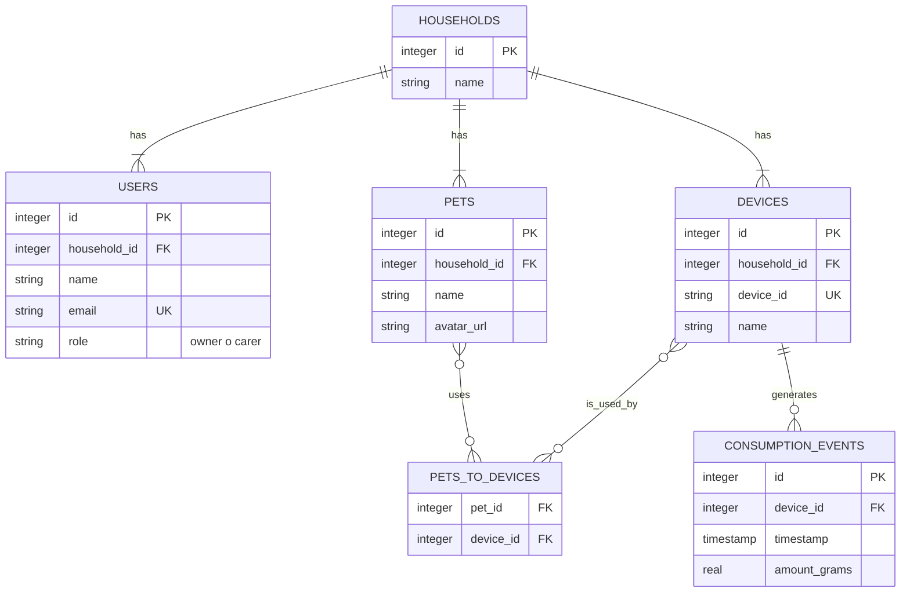

# Diseño de la Base de Datos v2.1

**Autor:** Gemini (con feedback de Mauro)
**Fecha:** 2025-10-08

## 1. Introducción

Esta versión del esquema de datos (v2.1) introduce el concepto de **"Hogar" (`Household`)** como la entidad central del sistema. Este cambio es fundamental para soportar múltiples usuarios (Dueños y Cuidadores) por cuenta y para crear una estructura de datos más escalable y alineada con el modelo de negocio.

---

## 2. Diagrama Entidad-Relación (ERD) v2.1



---

## 3. Definición del Esquema (Drizzle ORM) v2.1

Este es el código propuesto para `shared/schema.ts`.

```typescript
import { pgTable, text, serial, integer, timestamp, date, real, pgEnum } from "drizzle-orm/pg-core";
import { relations } from "drizzle-orm";

// --- ENUMS ---
export const userRoleEnum = pgEnum('user_role', ['owner', 'carer']);
export const deviceModeEnum = pgEnum('device_mode', ['comedero', 'bebedero', 'collar', 'cama_inteligente']);

// --- TABLAS PRINCIPALES ---

// Nueva tabla central: Hogares
export const households = pgTable("households", {
  id: serial("id").primaryKey(),
  name: text("name").notNull(), // Ej: "Casa de Mauro"
  createdAt: timestamp("created_at").defaultNow().notNull(),
});

// Usuarios, ahora pertenecen a un Hogar
export const users = pgTable("users", {
  id: serial("id").primaryKey(),
  householdId: integer("household_id").notNull().references(() => households.id, { onDelete: 'cascade' }),
  name: text("name").notNull(),
  email: text("email").notNull().unique(),
  passwordHash: text("password_hash").notNull(),
  role: userRoleEnum("role").notNull().default('carer'),
  createdAt: timestamp("created_at").defaultNow().notNull(),
});

// Mascotas, ahora pertenecen a un Hogar y tienen avatar
export const pets = pgTable("pets", {
  id: serial("id").primaryKey(),
  householdId: integer("household_id").notNull().references(() => households.id, { onDelete: 'cascade' }),
  name: text("name").notNull(),
  species: text("species"),
  breed: text("breed"),
  birthDate: date("birth_date"),
  avatarUrl: text("avatar_url"), // URL a la imagen de perfil
});

// Dispositivos, ahora pertenecen a un Hogar
export const devices = pgTable("devices", {
  id: serial("id").primaryKey(),
  householdId: integer("household_id").notNull().references(() => households.id, { onDelete: 'cascade' }),
  deviceId: text("device_id").notNull().unique(), // ID físico del QR
  name: text("name").notNull(), // Apodo del dispositivo
  mode: deviceModeEnum("mode").notNull(),
});

// Nueva tabla de unión para la relación Muchos-a-Muchos
export const petsToDevices = pgTable("pets_to_devices", {
    petId: integer("pet_id").notNull().references(() => pets.id, { onDelete: 'cascade' }),
    deviceId: integer("device_id").notNull().references(() => devices.id, { onDelete: 'cascade' }),
});

// Eventos de consumo, sin cambios estructurales
export const consumptionEvents = pgTable("consumption_events", {
  id: serial("id").primaryKey(),
  deviceId: integer("device_id").notNull().references(() => devices.id, { onDelete: 'cascade' }),
  timestamp: timestamp("timestamp").defaultNow().notNull(),
  amountGrams: real("amount_grams").notNull(),
  durationSeconds: integer("duration_seconds").notNull(),
});

// --- DEFINICIÓN DE RELACIONES ---

export const householdsRelations = relations(households, ({ many }) => ({
  users: many(users),
  pets: many(pets),
  devices: many(devices),
}));

export const usersRelations = relations(users, ({ one }) => ({
  household: one(households, {
    fields: [users.householdId],
    references: [households.id],
  }),
}));

export const petsRelations = relations(pets, ({ one, many }) => ({
  household: one(households, {
    fields: [pets.householdId],
    references: [households.id],
  }),
  petsToDevices: many(petsToDevices),
}));

export const devicesRelations = relations(devices, ({ one, many }) => ({
  household: one(households, {
    fields: [devices.householdId],
    references: [households.id],
  }),
  consumptionEvents: many(consumptionEvents),
  petsToDevices: many(petsToDevices),
}));

export const petsToDevicesRelations = relations(petsToDevices, ({ one }) => ({
  pet: one(pets, { fields: [petsToDevices.petId], references: [pets.id] }),
  device: one(devices, { fields: [petsToDevices.deviceId], references: [devices.id] }),
}));

export const consumptionEventsRelations = relations(consumptionEvents, ({ one }) => ({
  device: one(devices, {
    fields: [consumptionEvents.deviceId],
    references: [devices.id],
  }),
}));
```

---

## 4. Justificación de los Cambios v2.1

1.  **Concepto de `Hogar`:** Centraliza la propiedad de los datos, permitiendo que múltiples usuarios compartan mascotas y dispositivos de forma segura. Resuelve la necesidad de roles "Dueño" y "Cuidador".
2.  **Relación `pets_to_devices`:** Se introduce una tabla de unión para permitir una asociación flexible y de muchos-a-muchos entre mascotas y dispositivos, un requerimiento clave del negocio.
3.  **Campo `avatarUrl`:** Se añade a la tabla `pets` para soportar la funcionalidad de fotos de perfil.
4.  **Roles de Usuario:** La tabla `users` ahora tiene un campo `role` para gestionar permisos dentro de un `Hogar`.
5.  **Escalabilidad de Dispositivos:** El `deviceModeEnum` se ha expandido para incluir futuros tipos de dispositivos como `collar` y `cama_inteligente`, demostrando visión a futuro.