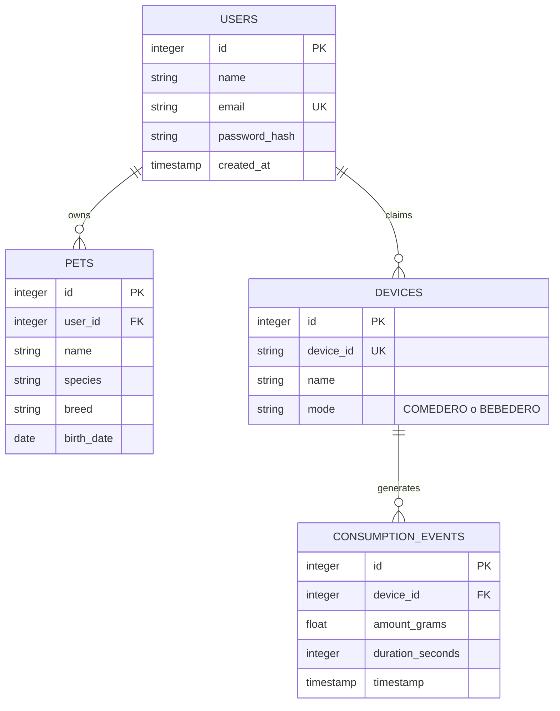

# Diseño de la Base de Datos v2.0

## 1. Introducción

Este documento presenta una estructura de base de datos revisada y optimizada para el ecosistema KittyPaw. El diseño está centrado en la claridad, la eficiencia de las consultas y la escalabilidad para soportar las funcionalidades definidas en el plan de negocio y producto.

---

## 2. Diagrama Entidad-Relación (ERD)


*Nota: El diagrama omite algunas columnas por simplicidad. La relación entre `PETS` y `DEVICES` ahora es indirecta a través del `USER`.*

---

## 3. Definición del Esquema (Drizzle ORM)

Este es el código propuesto para `shared/schema.ts`.

```typescript
import { pgTable, text, serial, integer, timestamp, date, real, pgEnum } from "drizzle-orm/pg-core";
import { relations } from "drizzle-orm";

// ENUM para el modo del dispositivo, más seguro que un texto libre.
export const deviceModeEnum = pgEnum('device_mode', ['comedero', 'bebedero']);

// Tabla de Usuarios unificada
export const users = pgTable("users", {
  id: serial("id").primaryKey(),
  name: text("name").notNull(),
  email: text("email").notNull().unique(),
  passwordHash: text("password_hash").notNull(),
  createdAt: timestamp("created_at").defaultNow().notNull(),
});

// Tabla de Mascotas, simplificada y ligada directamente al usuario
export const pets = pgTable("pets", {
  id: serial("id").primaryKey(),
  userId: integer("user_id").notNull().references(() => users.id, { onDelete: 'cascade' }),
  name: text("name").notNull(),
  species: text("species"),
  breed: text("breed"),
  birthDate: date("birth_date"),
});

// Tabla de Dispositivos, simplificada y ligada al usuario
export const devices = pgTable("devices", {
  id: serial("id").primaryKey(),
  deviceId: text("device_id").notNull().unique(), // ID físico del dispositivo (del QR)
  userId: integer("user_id").references(() => users.id, { onDelete: 'cascade' }), // Usuario que lo "reclamó"
  name: text("name").notNull(), // Nombre dado por el usuario, ej: "Comedero Cocina"
  mode: deviceModeEnum("mode").notNull(),
});

// Tabla de Eventos de Consumo, con columnas específicas y eficientes
export const consumptionEvents = pgTable("consumption_events", {
  id: serial("id").primaryKey(),
  deviceId: integer("device_id").notNull().references(() => devices.id, { onDelete: 'cascade' }),
  timestamp: timestamp("timestamp").defaultNow().notNull(),
  amountGrams: real("amount_grams").notNull(),
  durationSeconds: integer("duration_seconds").notNull(),
});

// --- Definición de Relaciones ---

export const usersRelations = relations(users, ({ many }) => ({
  pets: many(pets),
  devices: many(devices),
}));

export const petsRelations = relations(pets, ({ one }) => ({
  owner: one(users, {
    fields: [pets.userId],
    references: [users.id],
  }),
}));

export const devicesRelations = relations(devices, ({ many, one }) => ({
  owner: one(users, {
    fields: [devices.userId],
    references: [users.id],
  }),
  consumptionEvents: many(consumptionEvents),
}));

export const consumptionEventsRelations = relations(consumptionEvents, ({ one }) => ({
  device: one(devices, {
    fields: [consumptionEvents.deviceId],
    references: [devices.id],
  }),
}));
```

---

## 4. Justificación de los Cambios

1.  **Tabla `users` Única:** Se consolida `users` y `pet_owners` en una sola tabla `users`, simplificando la autenticación y la gestión de usuarios.
2.  **Relaciones Flexibles:** Se elimina la relación directa 1 a 1 entre `pets` y `devices`. Ahora, tanto mascotas como dispositivos pertenecen a un `user`. Esto permite que un usuario tenga múltiples mascotas y múltiples dispositivos. La lógica de qué mascota usa qué dispositivo se puede manejar a nivel de aplicación o con una tabla de enlace (`pets_to_devices`) en el futuro si fuera necesario, pero este diseño es mucho más flexible para empezar.
3.  **Tabla `consumptionEvents` Optimizada:** Se reemplaza el `jsonb` por columnas tipadas (`real` para gramos, `integer` para segundos). Esto hace que las consultas agregadas (promedios, sumas, etc.) sean órdenes de magnitud más rápidas y eficientes, lo cual es crucial para el dashboard y la futura IA.
4.  **Limpieza:** Se eliminan tablas como `mqtt_connections` que no pertenecen al core del modelo de datos de la aplicación, sino a una capa de servicio que puede ser gestionada de otra forma.
